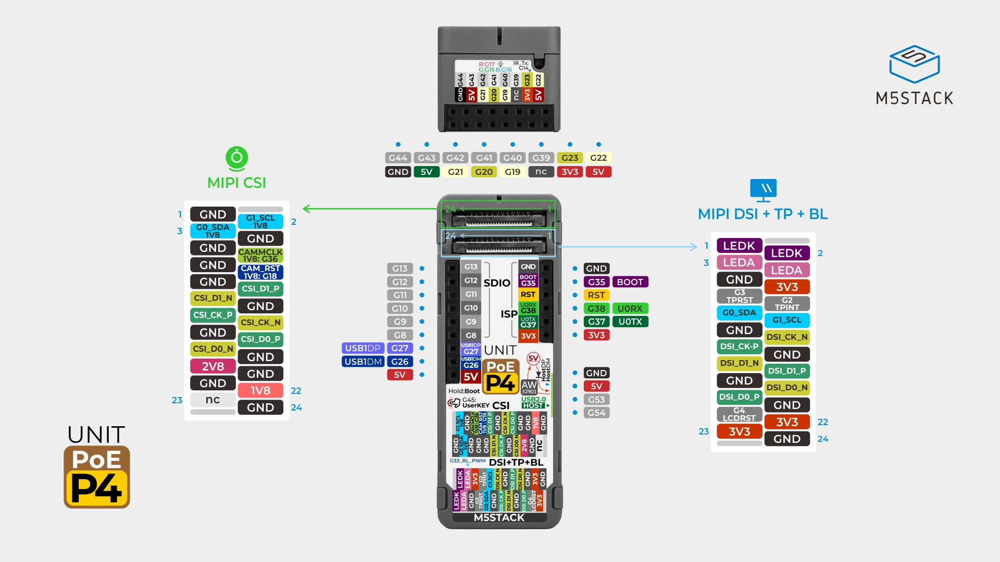

# M5 Stack ESP32-P4 POE

[Back to the README](../../README.md#board-pages)

## Overview

The M5 Stack ESP32-P4 POE has no screen as standard.

This page treats the board as **M5Stack Unit PoE-P4 (U213)**; the exact model of the owned unit remains **?** pending a label check. The [README comparison](../../README.md#specification-table) uses its manufacturer specifications, checked on 2026-09-07. [Source: M5Stack](https://docs.m5stack.com/en/unit/Unit_PoE-P4).

Display and camera connections are expansion interfaces. Wi-Fi, audio, and other unverified features remain **?** in the comparison. M5Stack lists PoE input with a 6 W maximum and IEEE 802.3at compliance. [Source: specifications](https://docs.m5stack.com/en/unit/Unit_PoE-P4#specifications).

## Pinout

Image: M5Stack, [original pin map](https://m5stack-doc.oss-cn-shenzhen.aliyuncs.com/1217/U213_PinMap_01.jpg). See the [official PinMap tables](https://docs.m5stack.com/en/unit/Unit_PoE-P4#pinmap) for Ethernet, display, camera, and expansion assignments.

## Schematic

- [Mainboard schematic (PDF)](https://m5stack-doc.oss-cn-shenzhen.aliyuncs.com/1217/SCH_StickPoE_SCH_Main_V0.2_20250829_2026_02_02_17_17_04.pdf)
- [Power board schematic (PDF)](https://m5stack-doc.oss-cn-shenzhen.aliyuncs.com/1217/SCH_StickPoE_SCH_POWER_V0.2_20250731_2026_02_02_17_17_39.pdf)
- [HAT expansion schematic (PDF)](https://m5stack-doc.oss-cn-shenzhen.aliyuncs.com/1217/SCH_StickPoE_SCH_Hat_V0.2_20250801_2026_02_02_17_16_35.pdf)

## References

- [M5Stack Unit PoE-P4 documentation](https://docs.m5stack.com/en/unit/Unit_PoE-P4) — specifications, pin map, schematics, and factory firmware links.
