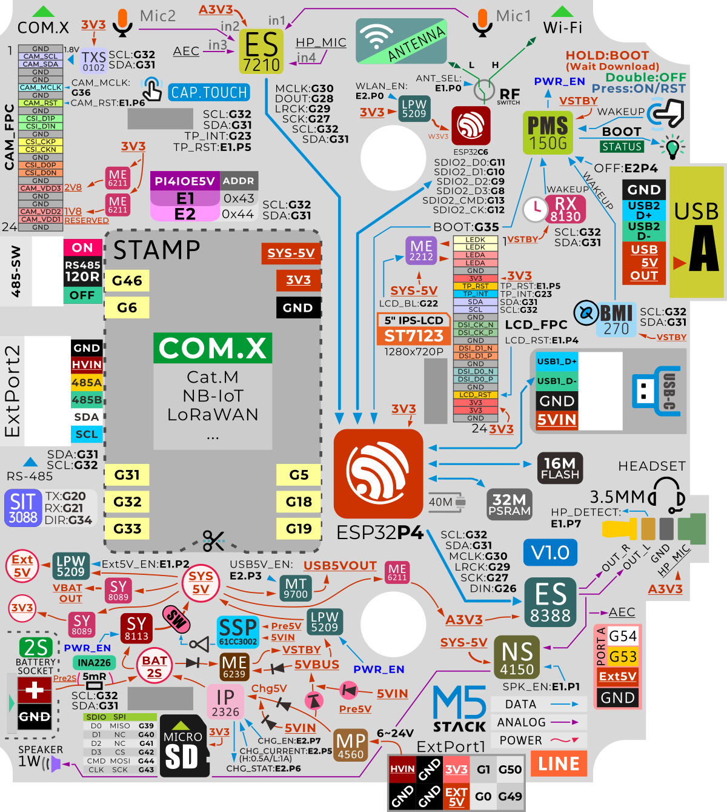

# M5 Stack TAB5

[Back to the README](../../README.md#board-pages)

## Overview

The M5 Stack TAB5 has no ethernet as standard.

Specifications in the [README comparison](../../README.md#specification-table) use M5Stack's Tab5 documentation (C145 / K145), checked on 2026-09-07. The standard C145 excludes the battery; K145 is the battery kit. [Source: M5Stack](https://docs.m5stack.com/en/core/Tab5).

The fitted display/touch controller is **?** until the unit's label is checked. M5Stack lists ILI9881C + GT911 and ST7123 / ST7121 variants; this affects driver selection. [Source: pin map and screen-driver change note](https://docs.m5stack.com/en/core/Tab5).

## Pinout

Image: M5Stack, [original pin map](https://m5stack-doc.oss-cn-shenzhen.aliyuncs.com/1132/C145_Pinmap_Overview.png). See the [official PinMap tables](https://docs.m5stack.com/en/core/Tab5#pinmap) for peripheral assignments.

## Schematic

- [Tab5 schematics (PDF)](https://m5stack-doc.oss-cn-shenzhen.aliyuncs.com/1132/Tab5_Schematics_PDF.pdf)
- [Overall design block diagram (PDF)](https://m5stack-doc.oss-cn-shenzhen.aliyuncs.com/1132/Tab5_Overall_Design_Block_Diagram.pdf)

## References

- [M5Stack Tab5 documentation](https://docs.m5stack.com/en/core/Tab5) — specifications, power, hardware variants, pin map, and software links.
- [Official ESP-IDF board support package](https://components.espressif.com/components/espressif/m5stack_tab5) — starting point for board integration; project compatibility is not yet verified.
