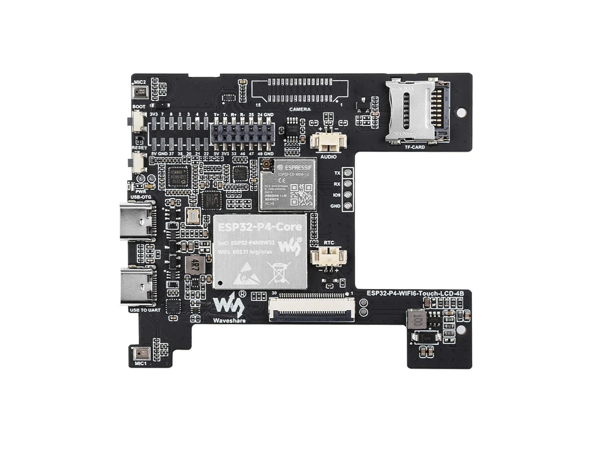
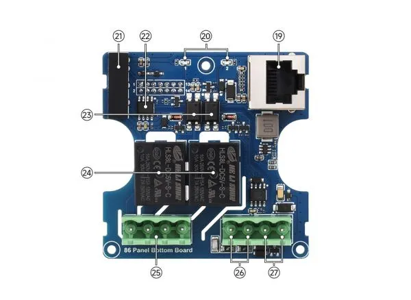

# Waveshare ESP32-P4 86 box

[Back to the README](../../README.md#board-pages)

## Overview

The Waveshare ESP32-P4 86 box is shipped with a version of ESP-Brookesia.

The project's relay version corresponds to **ESP32-P4-86-Panel-ETH-2RO (SKU 31570)**. The [README comparison](../../README.md#specification-table) uses this variant, checked on 2026-09-07. It has Ethernet, RS485, and two relays; its main board omits the camera connector fitted to the ESP32-P4-WIFI6-Touch-LCD-4B variant. [Source: Waveshare hardware comparison](https://docs.waveshare.com/ESP32-P4-WIFI6-Touch-LCD-4B#hardware-version-comparison).

PoE support is **?**: the documented inputs are USB-C and a 6–30 V DC terminal. The shipped ESP-Brookesia version and this project's tested configuration are **?**.

Image: Waveshare, [original relay-variant PCB image](https://docs.waveshare.com/assets/images/ESP32-P4-86-Panel-ETH-2RO-PCB-f1363ef312a6a5813221ce02d37c3a55.webp).

## Pinout

See Waveshare's [peripheral assignments](https://docs.waveshare.com/ESP32-P4-WIFI6-Touch-LCD-4B#peripheral-quick-reference) and [P2/P3 header pinouts](https://docs.waveshare.com/ESP32-P4-WIFI6-Touch-LCD-4B#pin-definition). Relay outputs use GPIO32 / GPIO46; RS485 uses GPIO47 (TX) / GPIO48 (RX).

Image: Waveshare, [original bottom-board diagram](https://docs.waveshare.com/assets/images/ESP32-P4-86-Panel-ETH-2RO-details-intro-2-3600da54bfbd02342b3d31f3ee1c20eb.webp).

## Schematic

- [Mainboard schematic (PDF)](https://files.waveshare.com/wiki/ESP32-P4-WIFI6-Touch-LCD-4B/ESP32-P4-WIFI6-Touch-LCD-4B.pdf)
- [86 Panel Bottom Board schematic (PDF)](https://files.waveshare.com/wiki/ESP32-P4-WIFI6-Touch-LCD-4B/86_Panel_Bottom_Board.pdf)

Waveshare links these from its [resources page](https://docs.waveshare.com/ESP32-P4-WIFI6-Touch-LCD-4B/Resources-And-Documents); use the hardware comparison above to distinguish populated connectors on each variant.

## References

- [Waveshare board documentation](https://docs.waveshare.com/ESP32-P4-WIFI6-Touch-LCD-4B) — memory, interfaces, variant differences, and pin assignments.
- [Waveshare product specifications](https://www.waveshare.com/product/mcu-tools/esp32-p4-wifi6-touch-lcd-4b.htm) — display, touch, audio, and relay specifications.
- [Waveshare ESP-IDF guide](https://docs.waveshare.com/ESP32-P4-WIFI6-Touch-LCD-4B/ESP-IDF) — development setup and examples.
- [Waveshare ESP-Brookesia example](https://github.com/waveshareteam/ESP32-P4-Platform/tree/main/examples/esp-idf/18_esp_brookesia_phone) — example already linked by this project; exact compatibility with the owned board is **?**.
